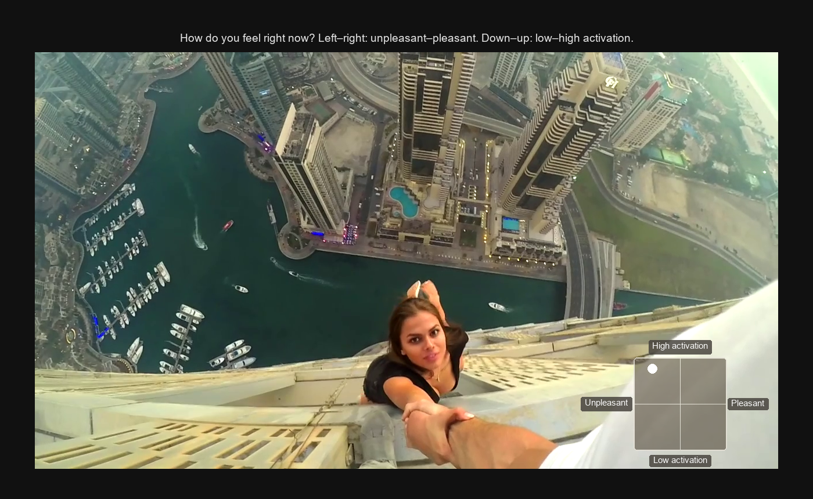
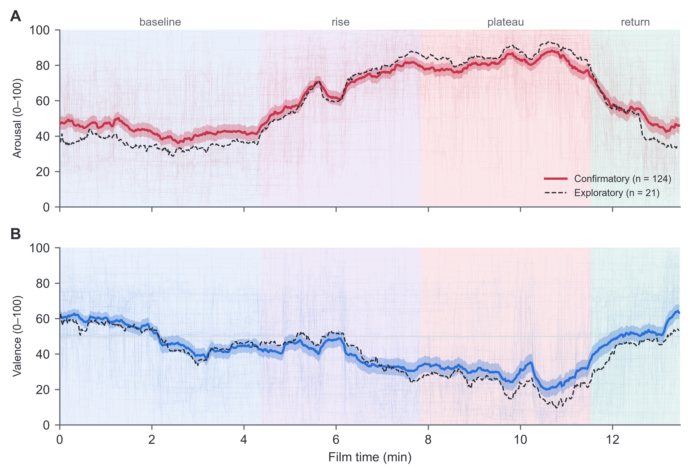
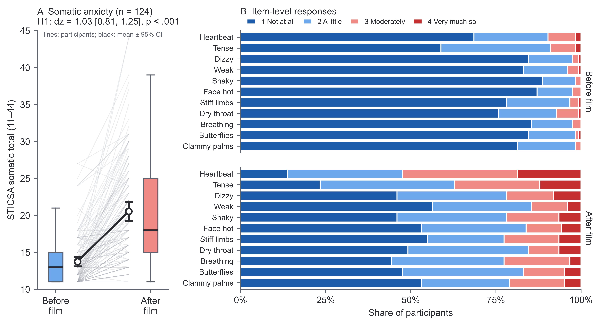
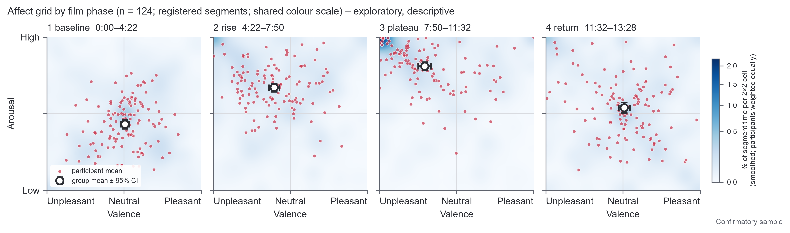

# Moment-to-Moment Affect During Film-Induced Somatic Anxiety

[](https://doi.org/10.5281/zenodo.23151387)
[](https://osf.io/s2yvb)

Micah G. Allen, Center of Functionally Integrative Neuroscience, Aarhus University
([ORCID 0000-0001-9399-4179](https://orcid.org/0000-0001-9399-4179)). Submitted to *Cognition and Emotion*
(Brief Article), October 2026.

This repository holds the data, analysis code, study materials and manuscript.

## Abstract

Studying sustained anxiety requires tracing how unpleasant arousal develops, persists and subsides over an unfolding
experience. We characterised a 13.5-min first-person film of people undertaking dangerous activities at height as an
induction for this purpose. Using an open-source browser-based platform developed for this study, online participants
continuously rated their own valence and arousal and completed the somatic subscale of the State-Trait Inventory for
Cognitive and Somatic Anxiety before and after viewing. In the confirmatory sample (*N* = 124), arousal was elevated
during the film's rising and sustained phases and declined towards the end, while valence was more unpleasant during
the sustained phase than during the opening. Group-mean trajectories closely reproduced the temporal shape observed in
an exploratory sample (*n* = 21; arousal *r* = .99; valence *r* = .94). Somatic anxiety increased after viewing
(*d*<sub>z</sub> = 1.03). Participants reporting larger increases rated the film as more arousing (*ρ* = .24) and more
unpleasant (*ρ* = −.38). The open-source platform and reference trajectories provide a reusable resource for studying
the temporal course of affect during a sustained anxiety induction.

*Keywords:* emotion induction, film, continuous ratings, valence and arousal, somatic anxiety

## Links

- **Archive:** [doi:10.5281/zenodo.23151387](https://doi.org/10.5281/zenodo.23151387) (Zenodo; this DOI always
  points to the latest version; v1.0.0, the submission version, is 10.5281/zenodo.23151388).
- **Preregistration:** [osf.io/s2yvb](https://osf.io/s2yvb), registered 2026-10-04 (public).
  Text in [docs/preregistration.md](docs/preregistration.md); decisions and deviations in
  [docs/prereg_log.md](docs/prereg_log.md).
- **Rating task:** the exact task and study settings used are in [materials/rating_task/](materials/rating_task/).
  The general tool is [online-affect-rating](https://github.com/embodied-computation-group/online-affect-rating)
  (tag `v1.0-heights-film` = the version used here).
- **Data preparation:** the scripts that turned the raw results into `data/processed/` are in
  [data_preparation/](data_preparation/) (a record; the raw data contain Prolific IDs and are not shared).
- **Paper:** [manuscript/manuscript.pdf](manuscript/manuscript.pdf) and
  [manuscript/supplement.pdf](manuscript/supplement.pdf) (download them to see every page; GitHub's preview can skip
  pages).

## Figures

**The rating task (Supplementary Figure S1).** Participants moved a dot within the affect grid in the corner of the
video: left to right for unpleasant to pleasant, down to up for low to high activation. Film frame at 10:36 with the
grid redrawn as in the task; the dot is the confirmatory sample's mean rating at that moment.



**Figure 1. Continuous arousal and valence ratings over the film.** Thin lines are individual participants of the
confirmatory sample; the thick line is the group mean with its 95% confidence interval (N = 124); the dashed line is
the exploratory sample's group mean (n = 21). Shading marks the four preregistered segments.



**Figure 2. Somatic anxiety before and after the film.** (A) STICSA somatic totals (11–44) before and after; grey lines
connect each participant's scores, boxes show medians and interquartile ranges, and the black line shows means with
95% confidence intervals. (B) Share of participants giving each answer to the
eleven somatic items, before (top) and after (bottom).



**Affect-grid occupancy by segment (Supplementary Figure S4, exploratory).** Blue shading shows the share of viewing
time in each region of the grid; dots are participants' mean ratings; the open circle is the group mean with 95%
confidence intervals.



## What you need

- [uv](https://docs.astral.sh/uv/) (installs the right Python and packages for you).

```bash
uv sync --locked      # set up the environment from uv.lock
uv run pytest         # check that everything works
```

## Data

`data/processed/` holds the de-identified data: one row per participant who completed the study (pilot and
cohorts 1–4), with pseudonyms instead of Prolific IDs and no free text. Column definitions are in
[data/processed/README.md](data/processed/README.md).

- **Exploratory sample:** pilot + cohort 1 (23 completed, 21 usable under the registered rules). Used to fix the
  segment edges and plan the study.
- **Confirmatory sample:** cohorts 2–4 (130 completed, 124 usable). Used only for the registered tests.

## Running the analysis

Three steps, run in order. Each writes its tables, figures and a run record to `results/<sample>/`:

```bash
uv run python analysis/01_sample.py         # sample, exclusions, age/sex/device
uv run python analysis/02_confirmatory.py   # H1-H6 + registered descriptives (about 1 min)
uv run python analysis/03_figures.py        # figures
```

The default is the exploratory sample (for development); `--sample confirmatory` uses the confirmatory sample. The
registered tests (`02_confirmatory.py`) were run once on the confirmatory sample (2026-10-04) and the script refuses
a second run. Figures and descriptive tables can be redrawn at any time.

```bash
uv run python analysis/04_affect_grid.py    # exploratory figure: affect grid by film phase
uv run python analysis/05_report_numbers.py # numbers and tables for the results report
cd manuscript && latexmk -pdf results.tex   # APA results report (manuscript/results.pdf)
```

## Repository layout

```text
analysis/          # the analysis: small, readable scripts and tested helper functions
data/processed/    # participant data (pseudonyms, no Prolific IDs or free text)
data_preparation/  # the scripts that made data/processed/ from the raw results (a record)
materials/         # the rating task and study settings exactly as used
docs/              # preregistration and its log
results/           # tables and figures written by the scripts
tests/             # tests, run with `uv run pytest`
TASKS.md           # what is being worked on next
VERIFICATION.md    # the checks behind each result
AI_ASSISTANCE.md   # how AI coding tools were used (for the paper's disclosure)
```

## Licence and history

Code: MIT (see `LICENSE`). Data in `data/processed/`: CC BY 4.0. The film is a third-party video and is not
included. This public repository starts from a single commit made on 2026-10-05; the commit hashes cited in run
records and in `docs/prereg_log.md` (e.g. the confirmatory run from `63d042d`) refer to the full development
history, which is kept in a private repository and is available on request.
